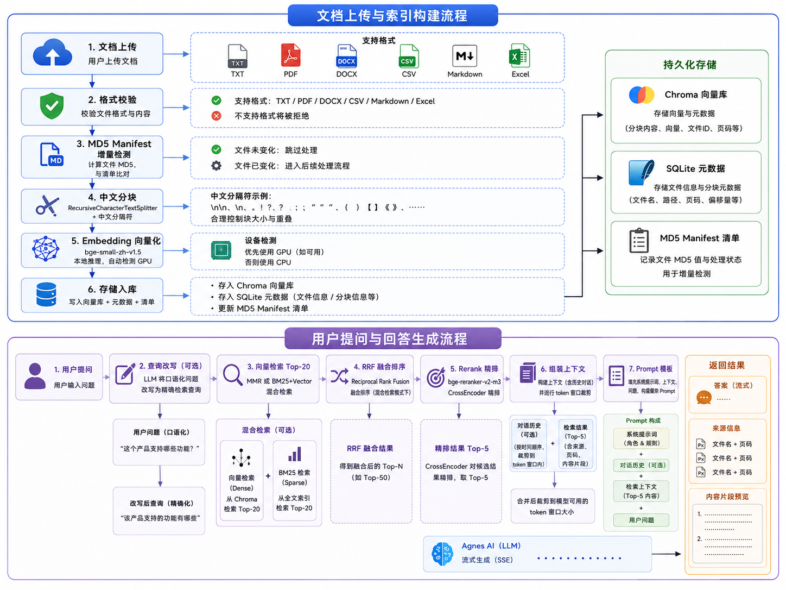
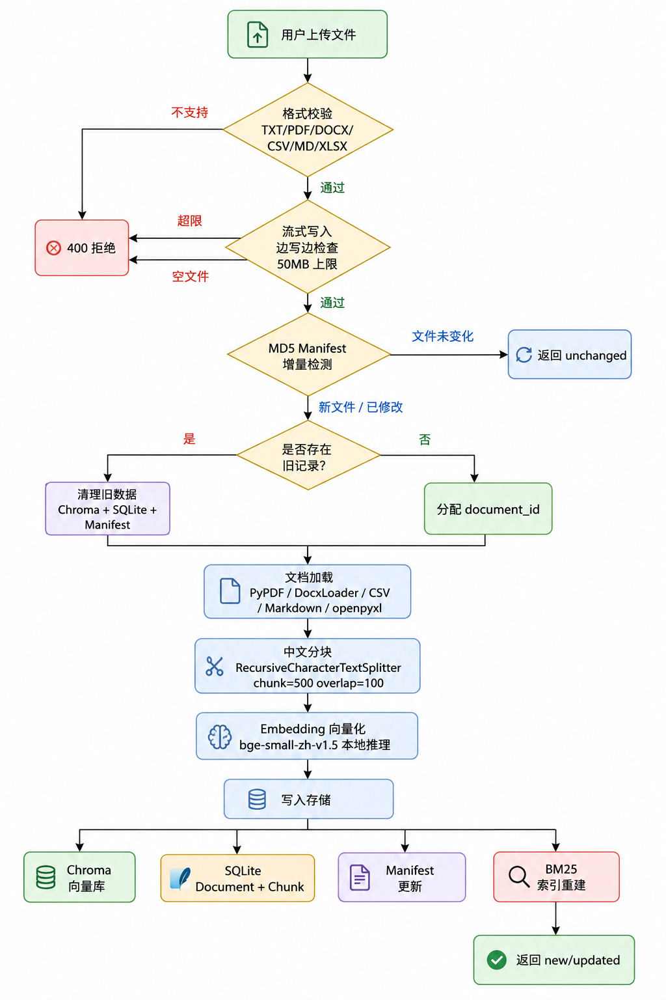
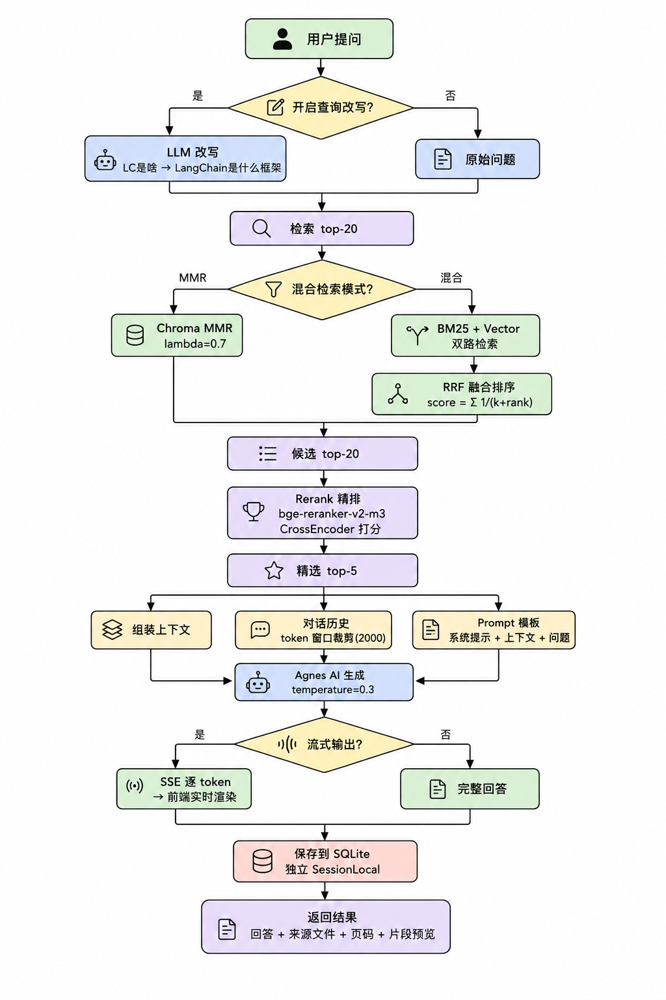

# 智能知识库问答系统

基于 LangChain + RAG 技术的智能知识库问答系统。支持多格式文档上传、增量同步、混合检索、Rerank 精排、查询改写、流式输出和来源追溯。



## 快速开始

### Docker 部署（推荐）

```bash
cp .env.example .env          # 1. 配置 API Key
docker compose up -d --build  # 2. 构建并启动（首次约 15-25 分钟）
```

| 服务 | 地址 |
|------|------|
| 问答界面 | http://localhost:8501 |
| API 文档 | http://localhost:8000/docs |
| 健康检查 | http://localhost:8000/health |

详见 [Docker 部署指南](DEPLOY.md)。

### 本地运行

```bash
pip install -r requirements.txt   # 1. 安装依赖
cp .env.example .env              # 2. 配置 API Key（编辑 .env 填入密钥）
python run.py                     # 3. 启动
```

### Docker vs 本地运行

| 对比项 | Docker 部署 | 本地运行 |
|--------|------------|---------|
| **安装** | `docker compose up -d --build` 一条命令 | 需手动安装 Python + pip install |
| **torch** | CPU 版（~200MB），无 GPU 加速 | CUDA 版（~2.5GB），自动检测 GPU |
| **Embedding 速度** | CPU 推理，较慢 | 有 GPU 时快 5-10 倍 |
| **Reranker** | CPU 推理，首次加载较慢 | 有 GPU 时显著加速 |
| **依赖隔离** | 容器内独立环境，不影响系统 | 安装到当前 Python 环境 |
| **首次启动** | 构建约 15-25 分钟（下载依赖+模型） | 安装依赖后秒启动 |
| **后续启动** | 约 30 秒 | 约 5 秒 |
| **数据持久化** | Docker volume（`app-data`） | 本地 `data/` 目录 |
| **日志查看** | `docker compose logs -f` | `logs/` 目录下的文件 |
| **模型更新** | 需重新构建镜像 | 直接重新下载 |
| **适用场景** | 分发给他人、部署到服务器、环境隔离 | 日常开发调试、需要 GPU 加速 |

> **建议**：日常开发用本地运行（GPU 加速、调试方便），分发或部署用 Docker（环境一致、一键启动）。

## 功能特性

| 类别 | 能力 |
|------|------|
| **文档处理** | 6 种格式（TXT / PDF / DOCX / CSV / Markdown / Excel）、中文分块、MD5 增量同步、并发上传保护、精确删除 |
| **检索策略** | MMR 语义检索、BM25 + 向量混合检索（RRF 融合）、Rerank 精排（top-20 → top-5）、LLM 查询改写 |
| **问答追溯** | SSE 流式输出、多轮对话（token 窗口裁剪）、来源文件 + 页码 + 片段预览、LLM 自动生成标题 |
| **工程能力** | 9 个 API 端点、健康检查、请求追踪（X-Request-ID）、API Key 认证、孤儿数据自动清理、Alembic 迁移 |
| **部署** | Docker 一键部署（CPU-only torch，约 3GB）、`python run.py` 本地一键启动 |

## 实现原理

### 文档上传



### 问答检索



## 技术栈

| 模块 | 选择 | 说明 |
|------|------|------|
| LLM | Agnes AI (agnes-2.0-flash) | OpenAI 兼容接口，支持流式输出 |
| RAG 框架 | LangChain | 文档加载、分块、检索、链式调用 |
| Embedding | BAAI/bge-small-zh-v1.5 | 本地推理，512 维，中文优化，自动检测 GPU/CPU |
| Reranker | BAAI/bge-reranker-v2-m3 | CrossEncoder 精排 |
| 向量库 | Chroma | 持久化存储，支持 MMR 检索 |
| 混合检索 | BM25 + Chroma | jieba 分词，RRF 融合排序 |
| 前端 / 后端 | Streamlit + FastAPI | SSE 流式输出，Swagger 文档 |
| 数据库 | SQLite + SQLAlchemy + Alembic | 4 表设计，ORM，迁移支持 |
| 日志 | loguru | 控制台 + 文件轮转 + 结构化 JSON |

## 项目结构

```
fsxm3/
├── config/settings.py          # 配置中心（pydantic-settings，从 .env 加载）
├── core/                       # RAG 核心模块
│   ├── llm.py                  #   LLM 调用（Agnes AI，重试机制）
│   ├── embeddings.py           #   Embedding（自动检测 GPU/CPU）
│   ├── reranker.py             #   Rerank 精排
│   ├── vectorstore.py          #   Chroma 向量库
│   ├── document_processor.py   #   文档加载 + 分块（6 种格式）
│   ├── retriever.py            #   检索入口（MMR / Hybrid + Rerank）
│   ├── hybrid_retriever.py     #   BM25 + Vector 混合检索
│   └── query_rewrite.py        #   LLM 查询改写
├── db/                         # 数据层
│   ├── database.py             #   SQLite 引擎 + 会话管理
│   └── models.py               #   ORM: Conversation / Message / Document / Chunk
├── manifest/manager.py         # MD5 增量同步
├── api/                        # FastAPI 后端
│   ├── main.py                 #   入口（lifespan / 中间件 / 健康检查）
│   ├── schemas.py              #   请求/响应模型
│   └── routers/
│       ├── chat.py             #   对话 API（普通 + SSE 流式）
│       └── documents.py        #   文档 API（上传 / 列表 / 删除）
├── ui/app.py                   # Streamlit 前端
├── prompts/templates.py        # RAG Prompt 模板
├── alembic/                    # 数据库迁移
├── tests/                      # 单元测试（24 个）
├── data/                       # 运行时数据（.gitignore）
├── Dockerfile                  # Docker 镜像
├── docker-compose.yml          # Docker 编排
├── docker-entrypoint.sh        # 容器启动脚本
└── run.py                      # 本地一键启动
```

## API 接口

| 方法 | 路径 | 功能 |
|------|------|------|
| POST | `/api/chat` | 发送消息，获取 AI 回答 |
| POST | `/api/chat/stream` | SSE 流式输出回答 |
| GET | `/api/conversations` | 列出所有对话 |
| GET | `/api/history/{id}` | 获取对话历史消息 |
| DELETE | `/api/conversations/{id}` | 删除对话及其消息 |
| POST | `/api/documents/upload` | 上传文档 |
| GET | `/api/documents` | 列出所有已上传文档 |
| DELETE | `/api/documents/{id}` | 删除文档（全链路清理） |
| GET | `/health` | 健康检查 |

## 配置说明

编辑 `.env` 文件调整参数（完整模板见 [.env.example](.env.example)）：

| 参数 | 默认值 | 说明 |
|------|--------|------|
| `ZHIPUAI_API_KEY` | （空） | Agnes AI API Key |
| `ZHIPUAI_MODEL` | `agnes-2.0-flash` | LLM 模型 |
| `ZHIPUAI_BASE_URL` | `https://apihub.agnes-ai.com/v1` | LLM API 地址 |
| `EMBEDDING_MODEL` | `BAAI/bge-small-zh-v1.5` | Embedding 模型 |
| `RERANKER_MODEL` | `BAAI/bge-reranker-v2-m3` | Rerank 模型 |
| `CHUNK_SIZE` / `CHUNK_OVERLAP` | `500` / `100` | 分块参数 |
| `RETRIEVAL_TOP_K` / `RERANK_TOP_K` | `20` / `5` | 检索参数 |
| `API_KEY` | （空） | API 认证密钥（为空不启用） |
| `HISTORY_MAX_TOKENS` | `2000` | 对话历史 token 窗口 |

## 测试

```bash
python -m pytest tests/ -v
```

## 常见问题

**Q: 上传超时？** A: 检查 `.env` 中的 API Key 和模型配置是否正确。

**Q: 无法连接后端？** A: 访问 http://localhost:8000/docs 看到 Swagger 页面即正常。

**Q: 回答不准确？** A: 尝试开启"混合检索"和"查询改写"功能，或优化提问方式。

**Q: Reranker 首次加载慢？** A: 首次需加载模型（约 2.2GB），后续从缓存秒开。

**Q: 如何更换模型？** A: 编辑 `.env` 中的 `ZHIPUAI_MODEL` 和 `ZHIPUAI_BASE_URL`，重启服务。

**Q: Docker 构建失败？** A: `docker compose build --no-cache` 重试。网络问题参考 [DEPLOY.md](DEPLOY.md)。
